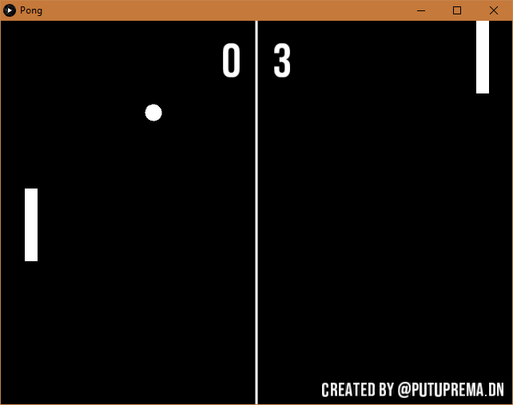

# Pong
Pong is a classic table-tennis like game made by Atari for arcade video games in 1972. This my attempt to create the game using Processing IDE

## How To Play
1. Use "W" to move the paddle up and "S" to move the paddle down.
2. Defeat the super hard enemy AI by being the first one to get to 10 points. 
## Download
1. You can download the game [here](https://github.com/putuprema/pokedex-master/releases).
## Or build your own!
The game is made using Processing IDE. The language used is simplified version of Java. You can only compile the game using Processing. Download Processing [here](https://processing.org/download/).